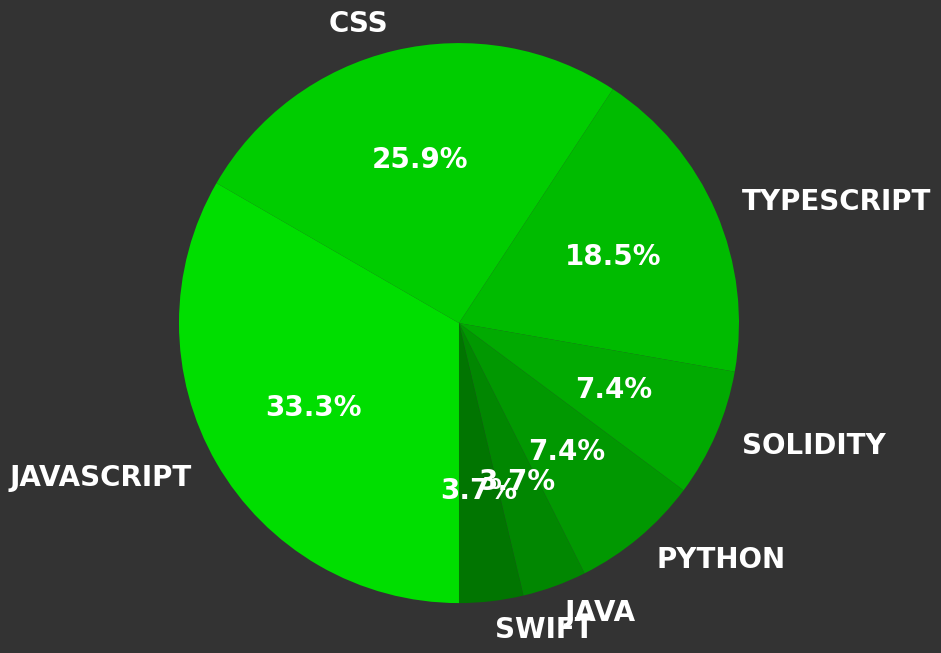

# FiendsXYZ's GitHub Stats

## 📊 Quick Stats

- **Total Repositories**: 49
- **Total Stars Earned**: 2
- **Total Forks**: 3
- **Total Watchers**: 2
- **Languages Used**: 8
- **Average Repository Size**: 122.31 MB

## 📈 Commit Activity

- **Last 24 hours**: 86 commits
- **Last 7 days**: 442 commits
- **Last 30 days**: 1044 commits
- **Last 365 days**: 2171 commits

## 📝 Top Languages by Lines of Code

- **JavaScript**: 64041 LOC
- **Solidity**: 15799 LOC
- **TypeScript**: 14492 LOC
- **CSS**: 13405 LOC
- **Handlebars**: 2327 LOC
- **MDX**: 1226 LOC
- **Python**: 1088 LOC
- **Swift**: 672 LOC
- **HTML**: 516 LOC
- **C#**: 459 LOC
